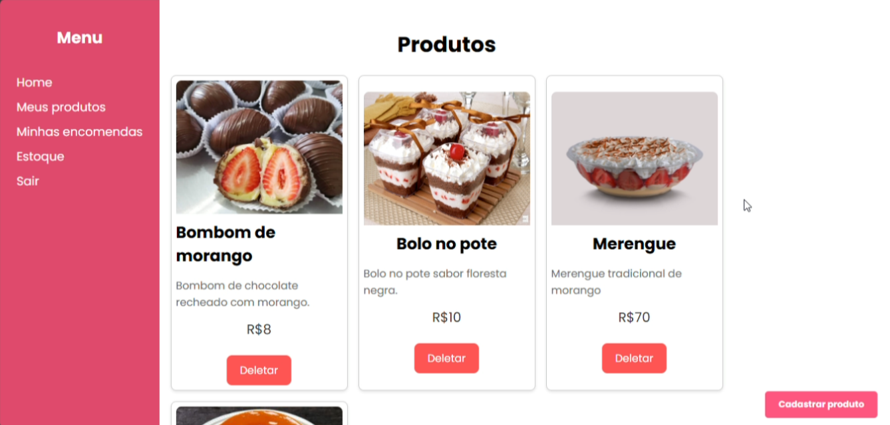

<h1 align="center">Confectionery Order Management System</h1>

A complete system (front-end and back-end) developed to manage orders for sweets and savory items in a confectionery shop. The system allows creating, listing, updating, and deleting orders, as well as managing customers and order statuses.

    <h4>Technologies Used:</h4>
    <ul>
        <li><strong>Back-end:</strong> Java with Spring Boot to build a RESTful API.</li>
        <li><strong>Database:</strong> PostgreSQL to store data for customers, orders, and products.</li>
        <li><strong>Front-end:</strong> ReactJS with TypeScript for user interface.</li>
        <li><strong>Authentication:</strong> JWT (JSON Web Tokens) for user authentication and authorization.</li>
    </ul>

    <h4>API Routes:</h4>
    
The main routes implemented for the order CRUD are:

    <ul>
        <li><code>GET /orders</code>: Returns the list of all registered orders.</li>
        <li><code>POST /orders</code>: Registers a new order, including customer and products.</li>
        <li><code>GET /orders/{id}</code>: Returns the details of a specific order.</li>
        <li><code>PUT /orders/{id}</code>: Updates the details of an existing order.</li>
        <li><code>DELETE /orders/{id}</code>: Deletes an order from the system.</li>
    </ul>
    
The front-end, developed in ReactJS, consumes these routes using Axios to make HTTP requests.

